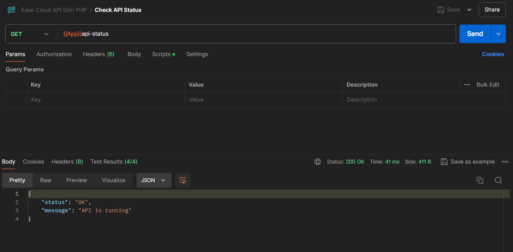
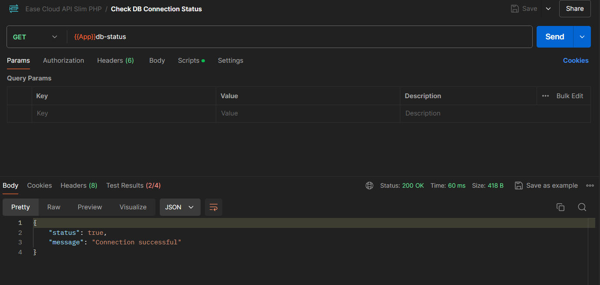
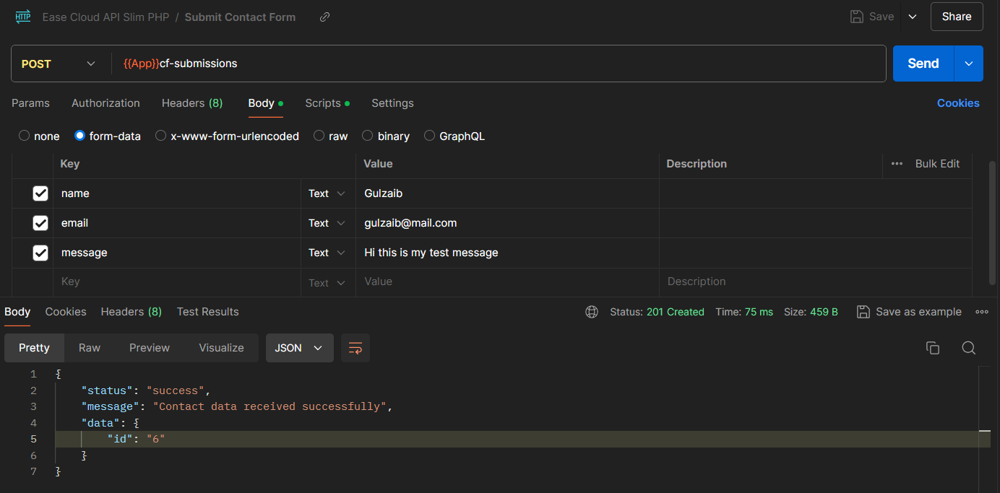
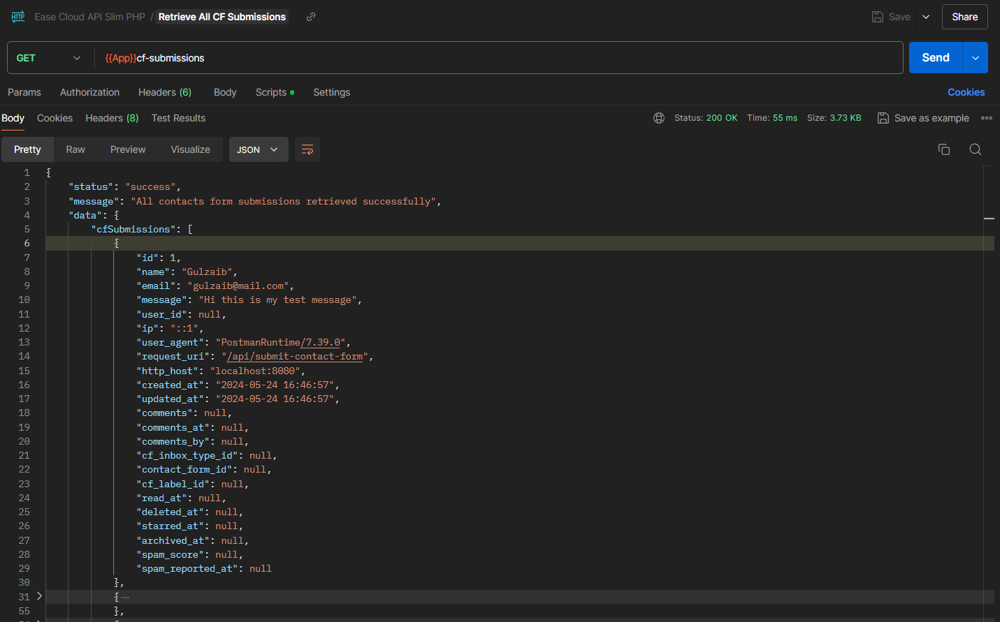

# Ease Cloud Slim PHP API

A simple yet fast and powerful API built on the top of Slim PHP framework.

## Tech Stack

- PHP
- Slim PHP
- MySql

## Installation

1. Clone the Project or download zip file.
2. Navigate to the project root directory.
3. Install Composer dependencies by running `compooser install` or `composer update`
4. Finally, serve the project by running the default php server `php -S localhost:8080 -t public/`

Wohooo 🎉! You're all setup.

## Postman Screenshots

### Check API Status

### Check DB Connection

### Submit Contact Form

### Retrieve All CF Submissions

